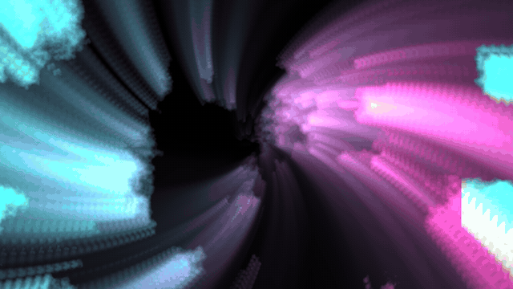
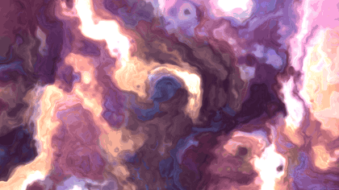
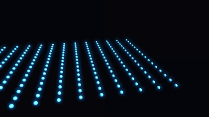
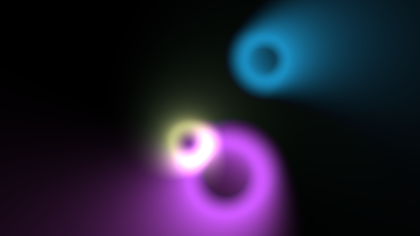

<div align="center">

# OpenTouchDesigner

**Node-based realtime visuals. Open source, cross-platform, no resolution cap.**
*In the spirit of TouchDesigner — written in Rust on wgpu.*

[](https://github.com/Ar9av/opentouchdesigner/actions/workflows/ci.yml)
[](https://github.com/Ar9av/opentouchdesigner/releases/latest)
[](LICENSE)




*This is the patch it opens on. Nine nodes, no shader —*
*the motion is the **feedback loop**, not any one operator.*

</div>

---

## Get it

**macOS** — [**download the .dmg**](https://github.com/Ar9av/opentouchdesigner/releases/latest) · Apple Silicon

It is unsigned, so the first launch is refused. Right-click → Open, or
`xattr -dr com.apple.quarantine /Applications/OpenTouchDesigner.app`. Signing
needs a paid Apple Developer account; saying so beats pretending otherwise.

Intel Macs build from source — a universal binary needs a universal Python for
PyO3 to link against, which a stock Homebrew install is not.

**Anywhere** — one command, nothing to install but Rust:

```bash
git clone https://github.com/Ar9av/opentouchdesigner && cd opentouchdesigner
cargo run -p otd-app
```

No CMake, no vcpkg, no SDK downloads. macOS, Windows and Linux from the same
checkout.

---

## What you can make

<table>
<tr>
<td width="33%" align="center">
<br>
<b>plasma</b><br><sub>domain-warped fbm, one GLSL TOP</sub>
</td>
<td width="33%" align="center">
<br>
<b>instances3d</b><br><sub>256 spheres, one draw call, audio-driven</sub>
</td>
<td width="33%" align="center">
<br>
<b>feedback</b><br><sub>Shadertoy GLSL in a loop at 1920×1080</sub>
</td>
</tr>
</table>

All of these are **File → Examples**, and every one is generated from code —
`otd demo tunnel --out examples/tunnel.otd` — with a test that fails the build
if a committed example drifts from the demo it came from.

New here? **[docs/GUIDE.md](docs/GUIDE.md)** is the short version of how
realtime visuals are actually made: why motion comes from a loop, the five
recipes most good-looking patches are built from, and the reasons a patch ends
up looking like grey mud.

---

## Describe it, and it gets built


A floating bar over the canvas. Type a sentence, press Enter, get operators —
wired, positioned, parameters set, as **one undo**.

Or drop a picture on it and get the look back as operators: attach a reference
still and it works out what the thing is made of — the pattern, the contrast,
the feedback loop, the two colours — and builds that, as a patch you can turn.

Bring your own key — **Anthropic**, **OpenAI**, **OpenRouter** — or bring no key
at all and use the **Claude Code** or **Codex** CLI you are already signed in
to, which spends subscription quota rather than API credit.

It is not a chatbot bolted on the side:

- The model is told what the operators are **by the registry** — the same table
  the editor builds its menus from — so it cannot invent one or use a name that
  has been renamed.
- **Shaders are compiled before the node exists.** A shader that fails goes back
  to the model with the compiler's own error, once.
- Anything invented is dropped and reported; anything the model built and forgot
  to wire in is reported too.
- **Keys never enter a project file.** `.otd` is meant to be committed, and a key
  in a git history has to be *rotated*, not deleted.

`Cmd/Ctrl+K` summons it, `Escape` collapses it, `×` hides it, and it is gone
entirely in perform mode. → **[docs/AI.md](docs/AI.md)**

<br clear="right">

---

## Why this exists

TouchDesigner is superb and closed. The gaps it leaves are the whole pitch:

| | TouchDesigner | OpenTouchDesigner |
|---|---|---|
| **Linux** | no | yes |
| **Resolution** | 1280×1280 on the free tier | uncapped, 16-bit float throughout |
| **Project format** | binary `.toe` | **text, diffable, mergeable** |
| **Headless** | no | `otd run` on a server with no display |
| **Source** | closed | MIT |

The text format is the one that compounds. Turning one knob is a one-line diff —
asserted in a test, not claimed:

```ron
"brightness": (
-  value: Float(0.94),
+  value: Float(0.90),
),
```

---

## Headless

`otd` runs a project with no window at all — something TouchDesigner cannot do
on a Linux server.

```bash
otd run showfile.otd                                    # the show machine
otd render examples/tunnel.otd --node /out1 --frames 300 --out shots
otd stats examples/feedback.otd --frames 60 --node /out1
otd bundle showfile.otd --out /Volumes/USB/show         # project + components + media
otd docs --out docs/OPERATORS.md                        # the reference, generated
```

The 1080p feedback patch, headless on an M-series Mac:

```
frames        60 at 60 fps target
first frame   453.59 ms  (compilation and allocation)
cook    ms    median 0.14   p95 1.43   max 4.06
frame   ms    median 1.22   p95 8.73   max 17.88
budget  16.67 ms   1 frame(s) over
```

---

## Keys

| | |
|---|---|
| `Tab` | add an operator (auto-wires from the selection) |
| double-click | set a node as the output viewer |
| `B` | bypass the selected node |
| `Space` | play / pause time |
| `H` | reset the view |
| `Delete` | delete the selection (reconnecting the chain around it) |
| `I` / double-click a COMP | step inside a component |
| `U` | step back out (or click the breadcrumb) |
| `Cmd/Ctrl+Z` · `Cmd/Ctrl+Shift+Z` | undo · redo |
| `Cmd/Ctrl+K` | the assistant bar — describe a patch, Enter builds it |
| `F1` | perform mode — the editor disappears and the window is the output. `F1` or `Escape` to come back |
| drag background | pan · scroll to zoom |
| drag output port → input port | wire · click an input port to unwire |
| right-click a node | view · replace its file · add an effect after it · bypass · delete |
| drop a file on the network | the operator that plays it, already viewing |

**Your own material.** Drag a movie, an image, a WAV, a `.fs` ISF shader, a
`.csv`, a font or a `.otd` onto the network and you get the operator that
reads it, named after the file and already on the viewer. Drop onto an
existing node instead of onto empty canvas and the file lands there — swapping
the clip in a Movie File In, or making the player upstream of the Blur you
dropped it on. **Media → Import Media…** is the same thing through a file
dialog, **Media → Use Webcam** for a camera, and **Media → Add Effect** puts a
Level, Blur, Kaleidoscope or Chroma Key after whatever is selected and views
the result. Movies decode through `ffmpeg` (`brew install ffmpeg`); stills do
not need it.

The **Output** button in the top bar opens a second window showing only the
viewer, letterboxed — drag it to a projector and toggle Fullscreen.

**Perform mode** (`F1`) hides the editor in the main window instead. It is
cheaper as well as darker: with nothing on the canvas, every node that was
cooking only because it was visible stops, and what is left is the output
chain and anything explicitly flagged for render.

**File → Export Bundle…** copies the project, every `.otdc` component it uses
*and* every movie, image and audio file it references into one folder, with
the references rewritten relative to it, so the folder can be moved to a show
machine and still open. `otd bundle` does the same from the command line and
needs no GPU. Anything it could not find is listed rather than swallowed — a
bundle missing a file fails at 8pm, not at export time.

## What works

**Cook engine** (`otd-core`) — demand-driven, pull-based, memoized. A node
cooks only if it changed, an input produced new output, or it is *time
dependent*. Time dependence propagates downstream from animated parameters and
from intrinsically animated operators, so a static branch cooks once and then
costs nothing. Cycles are rejected at connect time; Feedback breaks them by
reading last frame instead. Each node reports its own cook time.

Operators that name a source by parameter rather than by wire — a Select TOP
pointing at `/blur1` — declare it as a dependency, so it cooks first and
propagates dirtiness and animation exactly like a wire. Feedback deliberately
does not, which is precisely what lets a feedback loop exist without a cycle
in the cook graph.

**Parameters** — the four-mode system, all four live: **Constant**,
**Expression**, **Export** (driven by a CHOP channel) and **Bind** (following
another parameter). Drag a channel from the panel onto a parameter to export
it; click the mode button to release it, keeping whatever value it was showing
so the picture doesn't jump. Expression mode runs a self-contained numeric
evaluator (`absTime`, `frame`, `sin`, `fit`, `clamp`, …), falling through to
Python for anything more. Switching a parameter to Expression and back does
not lose the constant underneath.

**Converters** — the other way across a family boundary. Wires are same-family
only, because that rule is what keeps a network readable at a glance; the
exception is a converter, and it is declared per *input* rather than per
operator, so a wire lands where it was meant to and is refused everywhere else.

| | reads | writes |
|---|---|---|
| **DAT to CHOP** | a table | channels, named by the header row |
| **CHOP to DAT** | channels | a table you can select, copy and send |
| **SOP to CHOP** | geometry | `Px`/`Py`/`Pz`, `N`, `uv`, `Cd` — one sample per point |
| **CHOP to TOP** | channels | a texture, a row per channel, for a shader to sample |
| **TOP to CHOP** | pixels | `r`, `g`, `b`, `a` — a row, a column, or the average |

**TOP to CHOP reads last frame**, and says so rather than pretending
otherwise: this frame's passes are still in a command encoder that has not been
submitted, and waiting for them would stall the frame on the render it is in
the middle of building. TouchDesigner's is one frame behind for the same
reason. It also costs a full GPU sync at the *source's* resolution — put a
Resolution TOP in front of it, because reading 1920×1080 back every frame to
get four numbers is the classic way to turn a 60 fps patch into a 12 fps one.

**Components** — In and Out operators inside a component surface as typed
connectors on its node, so a component's shape is defined by what is in it.
Custom parameters are its API: operators inside read them as `parent.gain`,
and the same network behaves differently in each instance without any of it
being duplicated. The boundary is a dependency in both directions, so
dirtiness and animation cross it by exactly the rules a wire uses.

A component can be saved as a `.otdc` file and shared: the project then holds
a reference and the instance's settings while the file holds the network, so
two projects using one component share one definition and editing it is one
diff. A component can instead **clone** another one in the same project,
following its structure while keeping its own parameter values. Either way,
re-reading a shared definition never resets the values an artist dialled in.

The **Replicator** is built out of those pieces: it watches a template DAT
and keeps one clone of its master component per data row — the first column
names each replicant, and a column whose header matches a custom parameter on
the master sets it. The table *is* the population; adding a row is adding an
instance. An unchanged table makes zero graph edits, a removed row removes
exactly its node, and anything you place inside the replicator by hand is
yours and is left alone.

**Assistant** — a floating bar over the canvas: describe a patch and have it
built into the network you are looking at. `Cmd/Ctrl+K` from anywhere, Enter
to build, `Escape` to collapse it to a pill, `✕` to hide it, and gone entirely
in perform mode. **📎** attaches a reference still — or drop one on the bar —
and the look in it is rebuilt as operators, with anything you type treated as a
correction to the picture rather than a description on its own. Anthropic, OpenAI or OpenRouter; paste a key or
set `ANTHROPIC_API_KEY` / `OPENAI_API_KEY` / `OPENROUTER_API_KEY`. Or pick
Claude Code or Codex, which need no key: they run the CLI this machine is
signed in to, so a patch costs subscription quota instead of API credit. See
[docs/AI.md](docs/AI.md).

It is not a chatbot bolted on the side. The model is told about the operators
**by the registry** — the same table the editor builds its menus and
`OPERATORS.md` from — so it cannot suggest an operator that does not exist or
one under a name it used to have, and there is no second list to keep in sync.
The reply is JSON, validated before anything is created: an invented operator
fails the whole plan (half a patch is worse than none), an invented parameter
is dropped and reported, values are coerced to the parameter's declared type,
and the lot is a single undo. Keys never enter a project file — they live in a
`0600` file outside every project, and provider errors are scrubbed of them
before they reach the panel. See [`docs/AI.md`](docs/AI.md).

**Palette** — *File → Palette* holds prebuilt components: `trails` (a
packaged feedback loop), `bloom`, `vignette` (a shader with knobs) and
`audiolevel` (microphone to one smoothed channel). Each is an ordinary
component you can step inside, so opening one up is the tutorial on building
your own. Their internal references are *relative* — the trails Feedback
targets `out1`, not an absolute path — which is why the same component works
wherever it lands; operator reference parameters resolve like file paths,
from the referencing node's own component.

**Python** (`otd-py`) — expressions are evaluated in two tiers. A small
built-in language handles the common case with no interpreter and no GIL;
anything it cannot parse goes to embedded CPython, with `math`, `random`,
`json`, TD's `clamp`/`fit`/`lerp`, and read-only access to the network through
`ch()`, `par()` and `parent()`. Compiled code is cached by source. An operator
path quoted inside an expression or a script becomes a cook dependency, so
`ch('/lfo1', 'chan1')` makes `/lfo1` cook first rather than reading it stale.
A failing expression keeps its constant and reports one line.

**DATs** (`otd-dat`) — Table, Text, Select, Merge, Sort, Transpose, Convert,
Substitute, JSON, Script, Execute, CHOP Execute, Parameter Execute, UDP In,
UDP Out and Null. A table's contents live in the project file, so a cue list is
versioned with the patch that uses it. Script DATs run Python and return
rows. UDP In presents received datagrams as a table, one message per row;
UDP Out sends its input's text as one datagram when it *changes* — a DAT
cooks whenever anything upstream does, and resending an unchanged payload
every cook would turn a cook into a broadcast. Both are tested as real
loopbacks, like OSC and DMX.

**3D** (`otd-sop`, `otd-gpu`) — Box, Sphere, Tube, Torus, Circle, Grid, Line,
Transform, Noise, Color, Merge, Copy and Null SOPs; Geometry, Camera and Light
components; PBR, Phong, Constant, Wireframe and Point Sprite materials, each
with an optional colour map; and a Render TOP with a depth buffer whose output is an ordinary
texture, so a TOP chain after it neither knows nor cares that a camera was
involved.

Geometry is a flat interleaved buffer shaped exactly like the vertex buffer
the renderer wants, and filters are per-point functions rather than mesh
surgery — the form that ports to a compute shader unchanged, which is what
PLAN.md means by GPU-first.

**Instancing** — each *sample* of a CHOP is an instance, so a Pattern CHOP of
256 samples is 256 objects in one draw call, with position, scale, rotation
and colour each named by parameter. A single-sample channel broadcasts to all
of them, which is how one audio band makes the whole grid breathe.

**CHOPs** (`otd-chop`) — Constant, LFO, Noise, Pattern, Math, Lag, Filter,
Logic, Trigger, Timer, Speed, Count, Slope, Delay, Limit, Hold, Shuffle,
Rename, Analyze, Resample, Cross, Clock, Beat, Select, Merge, Switch,
Animation, Expression, Panel, Null, plus Audio Device In, Audio Device Out, Audio File In, Audio
Spectrum, MIDI In, MIDI Out, OSC In, OSC Out, DMX Out, Mouse In and Keyboard
In.

**Beat** and **Clock** are the two that are deliberately not the same clock.
Beat is derived from the timeline's absolute time rather than from a counter,
so a dropped frame does not put the tempo permanently behind — the same rule
the Animation CHOP and Movie File In follow. Clock is wall time, and keeps
running when the timeline is paused, which is what an installation that has to
change at 9pm needs.

**Audio File In** reads RIFF/WAVE itself — PCM in 8/16/24/32 bits or 32-bit
float, which is what a DAW bounces — rather than pulling in a media stack for
the one container that needs no codec. Playback is a function of the
timeline, not a private play head: the sample at time *t* is always the file
at *t*×speed, so scrubbing the timeline scrubs the audio and a headless
render reads exactly the samples the editor played. **MIDI Out** mirrors MIDI
In's channel naming (`n60`, `cc74`) and sends only *changes* — MIDI is an
event protocol, unlike DMX — with a note firing on the zero crossing and the
value at that moment as its velocity.

**DMX** — the DMX Out CHOP speaks Art-Net and sACN (E1.31), each channel a
slot in a universe. Neither protocol needs a vendor SDK — they are documented
UDP packet layouts — so the packet builders are unit-tested against real byte
offsets and a loopback test puts one on the wire.

Channels are **time sliced** the way TD does it: a generator emits however
many samples cover the frame interval that *actually* elapsed, so an LFO stays
on pitch and audio stays continuous when the renderer stutters. Devices run on
their own threads — cpal's audio callback, midir's MIDI thread, a socket
thread for OSC — and hand buffers to the cook; nothing device-related can
block a frame. A missing interface reports itself on the node and produces
silence rather than failing the cook, because losing a device mid-show must
not stop the render.

**TOPs** (`otd-gpu`) — Constant, Noise, Ramp, Circle, Rectangle, Text, GLSL, Level,
Transform, Blur, Edge, Threshold, HSV Adjust, Chroma Key, Lookup, Flip, Mirror,
Math, Displace, Composite, Switch, Resolution, Cache, Select, Null, Out,
Feedback, Movie File In, Movie File Out, Video Device In. All 16-bit float, no
resolution cap. One
command encoder per frame; transient textures are pooled and node outputs are
retained for as long as their cache is valid.

**Video and image in** — a Movie File In TOP plays stills (PNG, JPEG, WebP,
BMP, TGA, TIFF), movies (mp4, mov, mkv, webm, avi) and animated GIF; a Video
Device In TOP reads a camera. Stills are decoded in-process by the `image`
crate; everything that moves goes through an **ffmpeg subprocess** piping raw
RGBA, which is what PLAN.md §3 sanctions and is the honest alternative to
GStreamer — a system dependency that cannot be built or verified here. The
trade is real and worth stating: a pipe costs a memcpy and an upload per
frame where GStreamer would hand over a hardware surface. What it buys is
that it works on all three platforms today and nothing extra is needed to
*compile* OpenTouchDesigner. If ffmpeg is not installed, the node says so by
name and produces black.

Playback is a function of the timeline, like the Animation CHOP and Audio
File In: the frame at time *t* is always the file at *t*×speed, so scrubbing
the timeline scrubs the movie and `otd render` writes exactly the frames the
editor showed. Scrubbing backwards restarts the decode at the new time, since
a pipe cannot seek. A camera negotiates: `Requested W`/`H` and the frame rate
are requests, matched against the modes the device actually reports, because
AVFoundation refuses a mode it hasn't got rather than picking a near one.

**GLSL TOP** — your own shader, compiled while you type. WGSL is the primary
language: write a fragment body and `in.uv`, `U.time.x`, `U.res` and
`sample0/1(uv)` are already in scope. GLSL is also accepted, wrapped so a
Shadertoy `mainImage` with `iTime` and `iResolution` runs unmodified. Sources
are validated through naga *before* wgpu sees them, so a typo gives you a
message with a line number, the node outlines red, and the last shader that
compiled keeps running — a patch never goes black mid-edit.

**ISF import** — *Import ISF…* on a GLSL TOP loads an
[Interactive Shader Format](https://isf.video) shader. Its JSON header becomes
custom parameters on the node — floats with their ranges, colours, points,
`long`s as menus — and its `image` inputs become the node's texture inputs.
Afterwards it is an ordinary GLSL TOP: the imported dials can be exported to,
bound and animated like any others. Scalars share a `vec4` rather than each
taking one, and a shader that wants more uniform space than exists is refused
with a message instead of quietly aliasing onto the last slot.

**Performance monitor** — the *Perf* button lists every node that has cooked,
ranked by what it costs a *typical frame* rather than by what one cook costs.
Those differ in a demand-driven engine, and the difference is the whole design
made legible: in the `keyframes` patch the static Ramp TOP costs 0.81 ms per
cook and 0.007 ms per frame, because it cooks on 1% of them. Ranking by cook
time would put it at the top of the list and send you optimising the wrong
node. Clicking a row selects it. GPU memory — resident, pooled, textures
created — is on the same panel, and `otd stats` prints the same table
headless.

**Keyframes** — an Animation CHOP holds named curves with `constant`, `linear`,
`smooth` and `spline` keys. Making them a CHOP rather than a new subsystem is
the whole design: a keyed value is a value over time, which is what a channel
is, so keyframes export to parameters, filter, merge and lag like everything
else with no new mechanism anywhere. The keys are plain text in the project
file — `channel time value interp`, one per line — so moving one key is a
one-line diff, and typing twenty evenly spaced keys is faster than dragging
them. The parameter panel draws them as an editable curve on the same time
axis as the timeline.

**Timeline** — a scrubbable playhead with a loop range along the bottom. The
playhead *is* the network's clock, so dragging it drags the whole patch; there
is no second notion of time that could drift from what is rendering.

**Undo/redo** — everywhere, because it works by snapshotting the graph rather
than by writing an inverse for each of create, delete, wire, unwire, four
parameter modes, custom parameters, renames, flags and clones. Node ids survive
a snapshot, so the selection, the viewer and the engine's texture caches all
still point at the same nodes afterwards. Each checkpoint is tagged with what
is being edited, so dragging a slider across sixty frames undoes as the one
gesture it was.

**Project format** — text, path-sorted, defaults omitted. Adding a node
appends one block; rewiring changes one line. Multi-line shader sources
survive the round trip unchanged. See
[`examples/feedback.otd`](examples/feedback.otd).

**Editor** (`otd-app`) — node canvas with live per-node viewers, wiring,
parameter panel with a shader code editor and a draggable channel list, output
viewer, a second output window for a projector, cook/GPU statistics in the top
bar. The thumbnails are the operators' real textures shared with egui — no
copy, no readback.

**Text** — a Text TOP draws a caption, with alignment, line spacing and word
wrap, and its alpha is real so it composites over a picture like any other
texture. The glyphs are rasterised on the CPU and uploaded as coverage; the
colour is applied in the shader, which is what makes Colour a live parameter
rather than a reason to lay the text out again.

**No font is embedded.** Every face good enough to be a default is either large
or encumbered, and building one into the binary makes a licensing decision for
everyone who redistributes a build. The Font parameter takes a `.ttf` or `.otf`
— and it is a file reference, so a bundle carries the font to the show machine
— and with none set the operator looks through the places each platform keeps
its system faces. Finding none is a message on the node, not a black frame.

**Recording** — a Movie File Out TOP writes its input to h264, h265 or ProRes
through an ffmpeg subprocess, and passes the picture through so it can sit in
the middle of a chain rather than at the end of one. Two things about it are
deliberate. The frame is read back *after* the frame is submitted, not during
the cook, because a recording one frame behind what the artist watched is a
file that is wrong. And a full encoder queue **blocks** instead of dropping: a
dropped frame is not a stutter you can forgive, it is timing that stays wrong
forever, so the honest cost of recording is a slower editor while it runs.

**Panels** — Button, Slider and Field COMPs are widgets on the output,
clickable in perform mode and laid out in fractions of it, so a panel built
against a 1280×720 viewer lands in the same place on a 4K projector.

A widget is a node and its state is an ordinary parameter, which is the whole
design and everything else falls out of it: the fader positions are **in the
project file**, undo works on them because parameter edits are what undo is
made of, and a widget can be driven by the network as readily as it drives the
network — export a CHOP to a slider's Value and the slider moves. A Panel CHOP
gathers several of them into channels when eight faders would otherwise be
eight separate binds.

**Callbacks** — an Execute DAT runs Python on `onStart`, `onFrameStart` and
`onFrameEnd`; a CHOP Execute DAT on `onValueChange`, `onOffToOn` and
`onOnToOff`; a Parameter Execute DAT when a named parameter moves. Undefined
callbacks are simply not called, so a script implements the events it cares
about.

A callback can change the network — `setpar('/blur1', 'size', 12)` — but the
write is **queued, not applied where it is written**. The cook has to see one
unchanging graph, so the requests land between frames, in the same phase that
already syncs clones and replicators. The cost is worth stating plainly: an
edit made in a callback takes effect on the *next* frame. A failing callback
reports itself on the node and the frame keeps going, like everything else
here.

## What doesn't exist yet

**Texture sharing** — Spout, Syphon and NDI all need platform SDKs that cannot
be built or verified here, so none of them is written.

**Ableton Link** — not written. Everything else in
[PLAN.md](PLAN.md) Phases 0–6 is.

## Layout

```
crates/otd-core     graph, cook engine, parameters, project format  (no GPU, no UI)
crates/otd-chop     channels, time slicing, audio/MIDI/OSC          (no GPU, no UI)
crates/otd-dat      text and tables                                 (no GPU, no UI)
crates/otd-sop      geometry                                        (no GPU, no UI)
crates/otd-py       embedded CPython for expressions and scripts
crates/otd-gpu      wgpu TOP engine, shaders, the 3D pipeline
crates/otd-engine   the cross-family cook, demo patches, headless renderer
crates/otd-app      egui editor shell
crates/otd-cli      `otd` — the same engine with no window
crates/otd-ai       providers, key storage, patch generation      (no GPU, no UI)
```

`otd-gpu` and `otd-chop` know nothing about each other. `otd-engine` is the
only place they meet, and it exists for one reason: a TOP parameter in Export
mode has to read a CHOP channel cooked in the same frame.

`otd-core` has no GPU or UI dependency on purpose — it is what makes the cook
engine unit-testable and keeps a headless runtime and a future WASM playground
open.

## Docs

[`docs/GUIDE.md`](docs/GUIDE.md) — how to make something that looks good:
feedback loops, contrast before the loop, colourising through a ramp,
exporting audio onto parameters, stealing Shadertoy and ISF shaders,
instancing, and why a patch turns to mud.

[`docs/AI.md`](docs/AI.md) — the assistant: providers and keys, where a key is
and is not allowed to go, how the model is told what the operators are, and
what stops a bad reply damaging your patch.

[`docs/OPERATORS.md`](docs/OPERATORS.md) is the operator reference — all 79,
with their inputs, parameters, defaults and ranges. It is *generated* from the
same registry the editor builds its menus and parameter pages from, so it
cannot drift from what the operators actually do:

```bash
cargo run -p otd-cli -- docs --out docs/OPERATORS.md
```

An operator or parameter that arrives without prose fails the build, as does a
committed reference that has gone stale — enforcement PLAN.md wanted from PR
review, which holds until the week somebody is busy. The longer hand-written
notes live beside the generator and the editor shows the same text under
*How this works*, so there is one source rather than two that can disagree.

## Adding an operator

One `.wgsl` file in `crates/otd-gpu/src/shaders/`, one parameter function, one
uniform-packing function, one entry in the table in `crates/otd-gpu/src/ops.rs`.
Operator breadth is the main long-term risk, so the per-operator cost is kept
near zero deliberately. Or skip Rust entirely and paste a shader into a GLSL
TOP.

## License

MIT.
